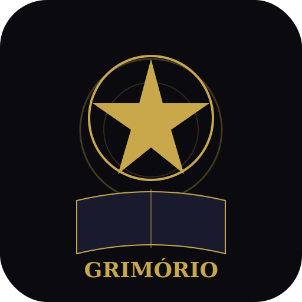

# 🔮 Grimório Digital

<div align="center">



**Seu grimório virtual de conhecimento místico**

*Tarot • Deuses Greco-Romanos • Herbologia • Fases da Lua • Anotações Mágicas*

[](LICENSE)
[](#instalação-no-celular)
[](#publicação-na-play-store)

[Demonstração](#funcionalidades) • [Instalação](#instalação) • [Play Store](#publicação-na-play-store) • [Tecnologias](#tecnologias)

</div>

---

## ✨ Sobre

O **Grimório Digital** é uma aplicação web progressiva (PWA) completa para estudo e prática de conhecimento místico. Com design imersivo dark/gold, funciona offline e pode ser instalada como app nativo no celular.

## 📚 Funcionalidades

### 🃏 Tarot Completo
- **22 Arcanos Maiores** com imagens clássicas do baralho **Rider-Waite-Smith (1909)** — domínio público
- **56 Arcanos Menores** (Copas, Ouros, Espadas, Paus) com imagens originais
- Significados normais e invertidos para cada carta
- Elemento, planeta regente e simbolismo detalhado
- **8 tipos de tiragens** com posições e indicações

### ⚡ Deuses Greco-Romanos
- **35+ deuses** com perfis completos (Olímpicos, Titãs, Primordiais)
- **Imagens clássicas** de esculturas e arte antiga do Wikimedia Commons
- História, poderes, símbolos e curiosidades de cada divindade
- Filtro por tipo (Olímpico / Titã / Primordial) e busca por nome

### 🌿 Herbologia
- **27 ervas** com propriedades científicas e mágicas
- Nome científico, elemento, planeta regente
- Instruções de uso prático
- Busca por nome ou propriedade

### 🌙 Lua, Dias & Cores
- **Fases da Lua** com energias e magias indicadas
- **Dias da Semana** com correspondências planetárias e deuses regentes
- **12 Cores Mágicas** com significados e usos rituais

### 📝 Anotações Pessoais
- Caderno mágico integrado para suas anotações
- Salva automaticamente no navegador (localStorage)
- Criar, editar e deletar notas

## 🛠️ Tecnologias

| Tecnologia | Uso |
|---|---|
| HTML5 / CSS3 / JavaScript | Aplicação completa sem frameworks |
| PWA (Service Worker + Manifest) | Instalação como app nativo, funciona offline |
| Google Fonts | Cinzel, Crimson Text, MedievalSharp |
| Font Awesome 6.5 | Ícones |
| Wikimedia Commons | Imagens de domínio público (Rider-Waite-Smith, esculturas clássicas) |
| localStorage | Persistência de anotações |

## 📱 Instalação

### No navegador (desktop)
1. Clone o repositório:
   ```bash
   git clone https://github.com/SEU_USUARIO/grimorio-digital.git
   ```
2. Abra `index.html` em um servidor local (ex: Live Server no VS Code)
3. Ou acesse a versão hospedada

### Instalação no celular (PWA)
1. Acesse o site pelo navegador do celular (Chrome, Safari, Edge)
2. No Chrome: toque no menu **⋮** → **"Instalar aplicativo"** ou **"Adicionar à tela inicial"**
3. No Safari (iOS): toque em **Compartilhar** → **"Adicionar à Tela de Início"**
4. O app abrirá em tela cheia, como um app nativo!

## 🏪 Publicação na Play Store

O Grimório Digital está preparado para publicação na Play Store via **TWA (Trusted Web Activity)**.

### Pré-requisitos
1. **Hospedar o site com HTTPS** (GitHub Pages, Netlify, Vercel, etc.)
2. Conta de desenvolvedor Google Play ($25 taxa única)

### Passo a passo

**Recomendado — use o [PWABuilder](https://www.pwabuilder.com/):**

1. Hospede o app com HTTPS (GitHub Pages, Netlify, Vercel, etc.)
2. Acesse **[pwabuilder.com](https://www.pwabuilder.com/)**
3. Cole a URL do seu site hospedado
4. Clique em **"Package for stores"** → **"Android"**
5. Baixe o AAB (Android App Bundle) gerado
6. Crie uma conta no [Google Play Console](https://play.google.com/console/) ($25 taxa única)
7. Faça upload do AAB e publique!

**Alternativa — Bubblewrap CLI:**
```bash
npm install -g @nicecode/nicecode
npx nicecode init --manifest https://seusite.com/manifest.json
npx nicecode build
```
Isso gera um projeto Android que empacota sua PWA como APK/AAB.

### Digital Asset Links
Após publicar, configure o arquivo `/.well-known/assetlinks.json` no seu servidor com a fingerprint SHA256 do seu certificado de assinatura:
```json
[{
  "relation": ["delegate_permission/common.handle_all_urls"],
  "target": {
    "namespace": "android_app",
    "package_name": "com.seudominio.grimorio",
    "sha256_cert_fingerprints": ["SUA_FINGERPRINT_SHA256_AQUI"]
  }
}]
```

## 📂 Estrutura do Projeto

```
grimorio-digital/
├── index.html              # Página principal
├── manifest.json           # Manifesto PWA
├── sw.js                   # Service Worker (cache offline)
├── README.md
├── LICENSE
├── css/
│   └── style.css           # Estilos (tema dark/gold, responsivo)
├── js/
│   ├── app.js              # Lógica principal da aplicação
│   ├── tarot.js            # Dados dos 78 arcanos + tiragens
│   ├── gods.js             # Dados dos 35+ deuses
│   ├── herbs.js            # Dados das 27 ervas
│   ├── moon.js             # Fases da lua, dias, cores
│   ├── notes.js            # Gerenciador de anotações
│   └── images.js           # URLs de imagens (Wikimedia Commons)
└── img/
    ├── icon.svg            # Ícone SVG do app
    ├── icon-192.png        # Ícone 192x192 (PWA)
    └── icon-512.png        # Ícone 512x512 (Play Store)
```

## 🎨 Design

- **Tema:** Dark místico com acentos dourados
- **Fontes:** Cinzel (títulos), Crimson Text (corpo), MedievalSharp (decorativo)
- **Paleta:** `#0a0a0f` (fundo) • `#c9a84c` (ouro) • `#1a1a2e` (cards)
- **Responsivo:** Desktop, tablet e mobile com menu hamburger
- **Acessibilidade:** Touch targets ≥ 44px, safe-area para celulares com notch

## 📄 Créditos de Imagens

- **Tarot Rider-Waite-Smith (1909):** Ilustrações de Pamela Colman Smith — [domínio público](https://en.wikipedia.org/wiki/Rider%E2%80%93Waite_Tarot#Copyright_status). Fonte: [Wikimedia Commons](https://commons.wikimedia.org/wiki/Category:Rider-Waite_tarot_deck)
- **Esculturas e arte clássica dos deuses:** Obras de domínio público. Fonte: [Wikimedia Commons](https://commons.wikimedia.org/)

## 📜 Licença

Este projeto está sob a licença MIT. Veja o arquivo [LICENSE](LICENSE) para mais detalhes.

As imagens do baralho Rider-Waite-Smith (1909) e as esculturas clássicas são de **domínio público**.

---

<div align="center">

**Feito com ✨ e código**

*"Todo grande feiticeiro começa com um bom grimório"*

</div>
